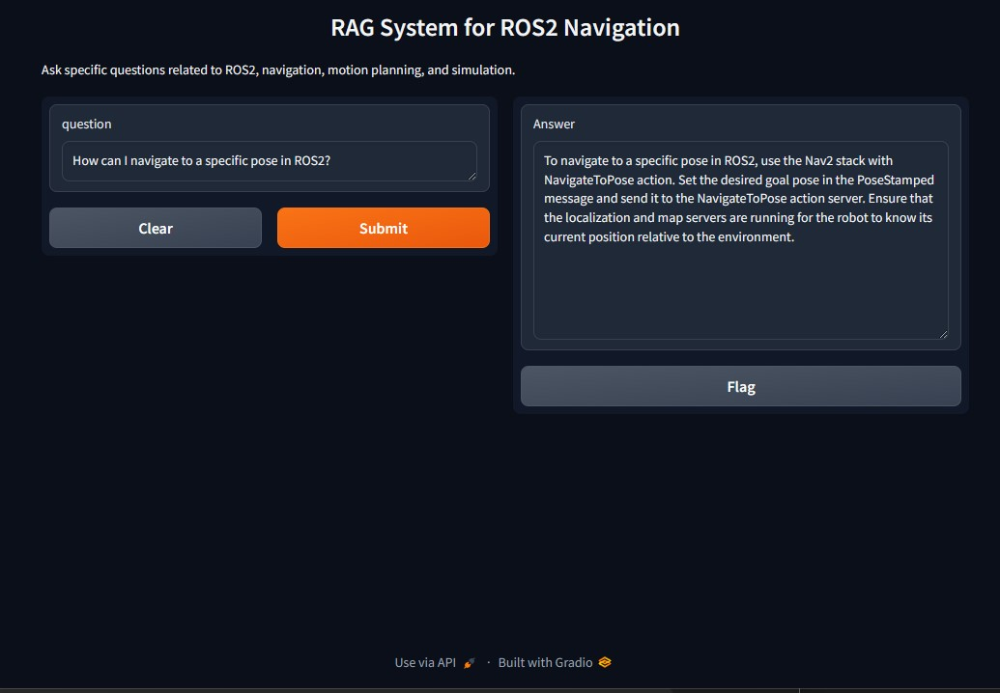
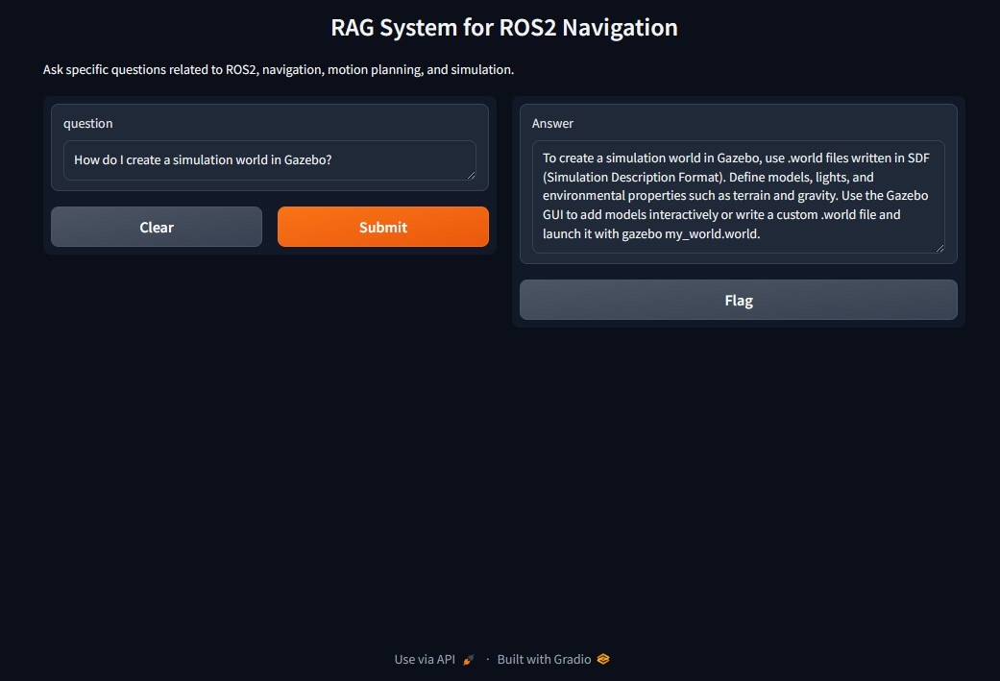
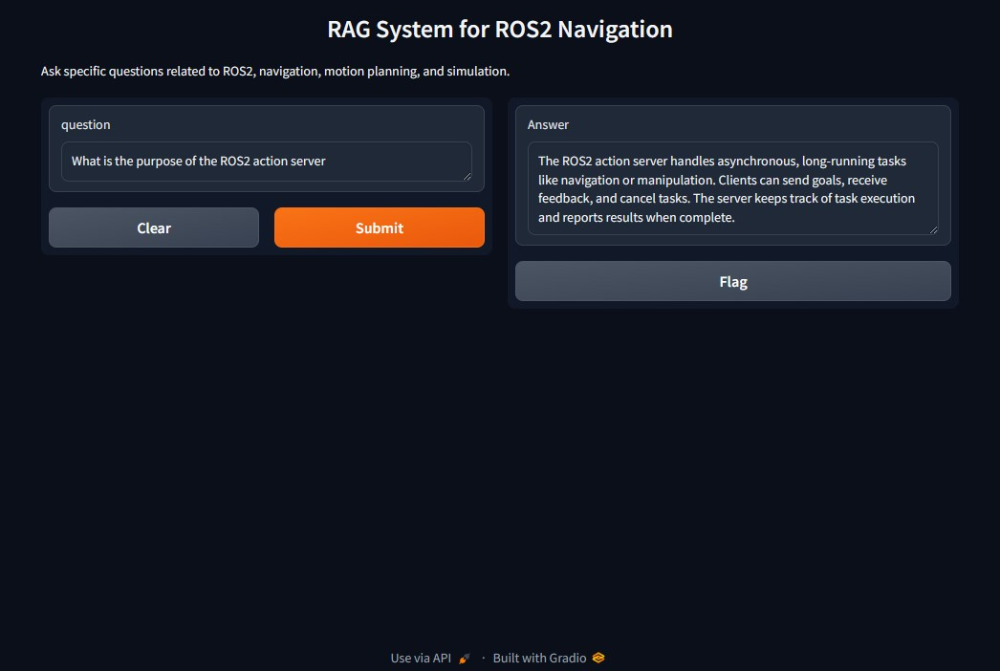

# RAG System for ROS2 Navigation - Project Overview

## Model Information

We have fine-tuned a text-generation model for answering questions related to ROS2 navigation, motion planning, and simulation.

**[Link to the Finetuned Trained Model](https://huggingface.co/ChaosKingNV/finetuned-ros2-model)**

---

## Project File Structure

```
RAG-Project/
├── app/                   # Main application directory
│   ├── app.py             # FastAPI application for API services
│   ├── gradio_app.py      # Gradio application for user interface
│   ├── Dockerfile         # Dockerfile for container setup
│   ├── requirements.txt   # Python dependencies
│   └── docker-compose.yml # Docker Compose configuration
│
├── etl/                   # ETL Pipeline for data extraction
│   ├── etl_pipeline.py    # Main ETL logic
│   └── config.py          # ETL configuration
│
├── featurization/         # Data featurization pipeline
│   ├── featurizer.py      # Vector embedding generation
│   ├── featurization_pipeline.py
│   └── config.py          # Featurization config
│
├── youtube_pipeline/      # YouTube data extraction and labeling
│   ├── youtube_transcript_collector.py
│   ├── question_answer_generator.py
│   └── config.py
│
├── finetuning/            # Model fine-tuning pipeline
│   ├── data_preprocessor.py
│   ├── model_trainer.py
│   ├── upload_to_hub.py
│   ├── config.py          # Fine-tuning configuration
│   └── clearml_tracker.py
│
├── clearml_integration/   # ClearML integration for experiment tracking
│   └── clearml_tracker.py
│
└── static/                # Static files and assets
    └── ...
```

---

## How It Works

1. **ETL Pipeline:** Extracts relevant data from YouTube videos and official ROS2 documentation.
2. **Featurization:** Converts raw data into vector embeddings using a Sentence Transformer model.
3. **Fine-Tuning:** Trains a Hugging Face model using labeled Q/A pairs generated during data processing.
4. **Model Deployment:** Uploads the trained model to Hugging Face Hub and registers it with ClearML for experiment tracking.
5. **Query System:**
   - **FastAPI API:** Handles API requests for querying the model.
   - **Gradio Interface:** Provides a user-friendly web interface.
   - **Vector Search:** Retrieves relevant documents from Qdrant based on query embeddings.
   - **Answer Generation:** Combines search results with the model’s capabilities to generate answers.

---

## How to Run

1. **Clone the Repository:**
   ```bash
   git clone https://github.com/your-repository/rag-project.git
   cd rag-project
   ```

2. **Start the Docker Containers:**
   ```bash
   docker-compose up --build
   ```

3. **Access the System:**
   - **API Endpoint:** `http://localhost:8000`
   - **Gradio Web App:** `http://localhost:7860`

---
## Screenshots





